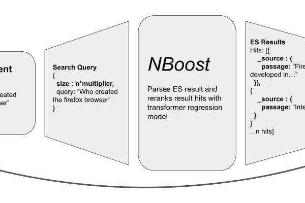

NBoost Documentation
=====================================

|
⚡ **NBoost** is a scalable, search-engine-boosting platform for developing and deploying state-of-the-art models to improve the relevance of search results.

Nboost leverages finetuned models to produce domain-specific neural search engines. The platform can also improve other downstream tasks requiring ranked input, such as question answering.

|
|

.. toctree::
   :maxdepth: 2
   :caption: Getting Started

   chapter/getting-started.md

.. toctree::
   :maxdepth: 3
   :caption: NBoost API

   chapter/cli.rst

.. toctree::
   :maxdepth: 3
   :caption: NBoost Modules

   api/nboost

.. toctree::
   :maxdepth: 2
   :caption: Benchmarking

   chapter/benchmarking.md

.. toctree::
   :maxdepth: 2
   :caption: Contributing

   chapter/CONTRIBUTING.md

.. toctree::
   :maxdepth: 1
   :caption: Changelog

   chapter/CHANGELOG.md

Indices and tables
==================

* :ref:`genindex`
* :ref:`modindex`
* :ref:`search`
